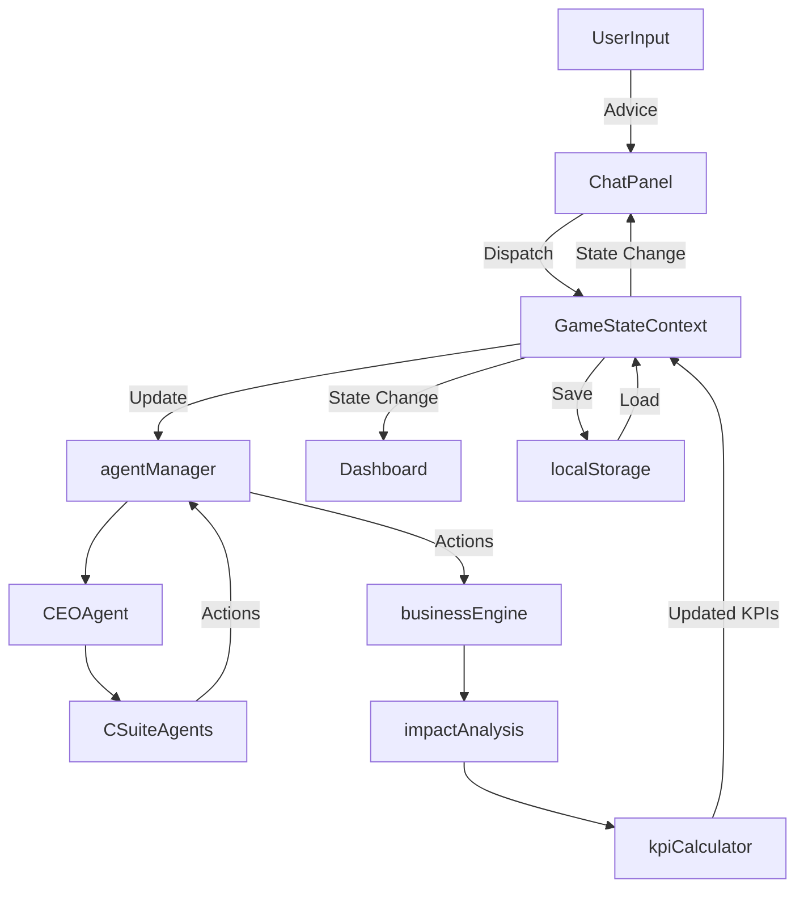

# Universal Paperclips Simulation Game

A business simulation game where players act as consultants to a hypothetical paperclip company, providing advice to the CEO and observing the impact of decisions on various Key Performance Indicators (KPIs).

## Tech Stack

- **Frontend**: Next.js 13+, React, TypeScript
- **Styling**: Tailwind CSS, Headless UI
- **Data Visualization**: Tremor
- **Backend**: Next.js API Routes with Edge Runtime
- **AI/ML**: LangChain, LangGraph
- **State Management**: React Context API (implemented in `GameStateContext.tsx`)
- **Persistence**: Local Storage
- **Linting**: ESLint
- **Testing**: Jest (or your preferred testing framework)
- **Code Quality**: ESLint, Prettier

## Key Features

- Interactive chat interface for providing business advice.
- Real-time KPI dashboard with Tremor charts.
- AI-powered CEO and C-suite agents using LangChain and LangGraph.
- Dynamic business cycle simulation with scenario generation.
- Responsive design for various screen sizes.
- State persistence using local storage.

## Getting Started

1. **Clone the repository**:

   ```bash
   git clone https://github.com/yourusername/universal-paperclips-simulation.git
   ```

2. **Navigate to the project directory**:

   ```bash
   cd universal-paperclips-simulation
   ```

3. **Install dependencies**:

   ```bash
   npm install
   ```

4. **Set up environment variables**:

   - Create a `.env.local` file in the root directory.
   - Add your OpenAI API key and any other required environment variables as specified in `.env.example`.

5. **Run the development server**:

   ```bash
   npm run dev
   ```

6. **Open the application in your browser**:

   - Navigate to [http://localhost:3000](http://localhost:3000)

## Development Setup

1. Install dependencies:
   ```bash
   npm install
   ```

2. Set up environment variables:
   - Create a `.env.local` file in the root directory.
   - Add your OpenAI API key:
     ```
     OPENAI_API_KEY=your_api_key_here
     ```

3. Run the development server:
   ```bash
   npm run dev
   ```

4. Open [http://localhost:3000](http://localhost:3000) in your browser to see the application.

5. To run linting:
   ```bash
   npm run lint
   ```

6. To format code:
   ```bash
   npm run format
   ```

## Project Structure
```
project-root/
├── .next/
├── src/
│   ├── app/
│   │   ├── api/
│   │   │   ├── simulate/
│   │   │   │   └── route.ts
│   │   │   └── generateScenario/
│   │   │       └── route.ts
│   │   ├── fonts/
│   │   ├── globals.css
│   │   ├── layout.tsx
│   │   └── page.tsx
│   ├── components/
│   │   ├── ui/
│   │   │   └── GameHeader.tsx
│   │   ├── game/
│   │   │   ├── ChatPanel.tsx
│   │   │   ├── MessageBubble.tsx
│   │   │   └── BusinessCycleHeader.tsx
│   │   └── dashboard/
│   │       ├── Dashboard.tsx
│   │       ├── CompanyOverview.tsx
│   │       └── KPIChart.tsx
│   ├── contexts/
│   │   └── GameStateContext.tsx
│   ├── hooks/
│   │   ├── useGameState.ts
│   │   ├── useGameStateLoader.ts
│   │   ├── useMessageHandler.ts
│   ├── lib/
│   │   ├── agents/
│   │   │   ├── agentManager.ts
│   │   │   ├── ceoAgent.ts
│   │   │   └── cSuiteAgents.ts
│   │   ├── simulation/
│   │   │   ├── businessEngine.ts
│   │   │   ├── kpiCalculator.ts
│   │   │   ├── impactAnalysis.ts
│   │   │   └── scenarioGenerator.ts
│   │   └── utils/
│   │       ├── api.ts
│   │       ├── localStorage.ts
│   │       └── openaiConfig.ts
│   ├─ types/
│   │   └── game.d.ts
│   └── app/
│       └── globals.css
├── public/
│   └── assets/
├── .eslintrc.json
├── .gitignore
├── next.config.mjs
├── package.json
├── postcss.config.mjs
├── tailwind.config.ts
├── tsconfig.json
└── README.md
```

## System Architecture Overview

The Universal Paperclips Simulation Game is designed with a modular architecture to facilitate scalability and maintainability. The application is divided into several layers and components that interact with each other to provide a seamless user experience.

### **Layers**

- **Presentation Layer**: Handles user interfaces and interactions.
- **Business Logic Layer**: Manages game logic, simulations, and AI agent interactions.
- **Data Access Layer**: Deals with data persistence and API communications.
- **AI Layer**: Implements AI agents and decision-making using LangChain and LangGraph.

## Component Interactions and Data Flow

### **High-Level Interaction Diagram**

Below is an overview of how the components interact within the application:

1. **User Interaction**: The user provides advice through the **Chat Panel**.
2. **Game State Update**: The input is captured and sent to the **GameStateContext**.
3. **Business Logic Processing**:

   - The **businessEngine** triggers the simulation.
   - The **agentManager** coordinates the **CEO Agent** and **C-suite Agents**.
   - **Agents** use the AI Layer (**LangChain**/**LangGraph**) to generate decisions.

4. **KPI Calculation**:

   - The **impactAnalysis** evaluates proposed actions.
   - The **kpiCalculator** updates the KPI state.

5. **UI Update**:

   - The **Dashboard** retrieves updated KPIs from the **GameStateContext**.
   - The **Chat Panel** displays new messages from agents.

6. **Data Persistence**:

   - The **localStorage** utilities save the game state.

### **Detailed Data Flow**

#### **1. User Input**

- **Component**: `ChatPanel.tsx`
- **Action**: User submits advice.
- **Data**: Advice text.
- **Flow**:
  - Dispatches action to the `GameStateContext`.
  - Adds user's message to the message history.

#### **2. AI Agent Interaction**

- **Component**: `agentManager.ts`
- **Action**: Processes user advice.
- **Data**: User advice, current situation, previous messages.
- **Flow**:
  - **CEO Agent** (`ceoAgent.ts`) considers advice.
  - Delegates tasks to **C-suite Agents** (`cSuiteAgents.ts`).
  - Agents generate responses using LangChain models.
  - Responses are added to the message history.

#### **3. Simulation and KPI Update**

- **Component**: `businessEngine.ts`
- **Action**: Runs simulation based on agents' decisions.
- **Data**: Agents' actions, current KPIs.
- **Flow**:
  - **Impact Analysis** (`impactAnalysis.ts`) evaluates risks.
  - **KPI Calculator** (`kpiCalculator.ts`) computes new KPI values.
  - Updated KPIs are stored in the `GameStateContext`.

#### **4. UI Rendering**

- **Components**:
  - `Dashboard.tsx` for KPIs.
  - `CompanyOverview.tsx` for company info.
  - `KPIChart.tsx` for individual KPIs.
- **Action**: Renders updated game state.
- **Data**: Messages, KPIs.
- **Flow**:
  - Subscribes to `GameStateContext` for changes.
  - Re-renders components when state updates.

#### **5. Data Persistence**

- **Utility**: `localStorage.ts`
- **Action**: Saves and loads game state.
- **Data**: Entire game state (messages, KPIs, cycle number).
- **Flow**:
  - On state change, saves to local storage.
  - On initialization, loads from local storage if available.

### **Component Interaction Diagram**



### **Data Models**

#### **Game State**

- **Current Cycle**
- **Current Situation**
- **KPI History**
- **Messages**

#### **Message Format**
```typescript
interface Message {
  role: 'user' | 'assistant' | 'system' | 'business_cycle' | 'simulation_group' | 'simulation';
  content: string;
  name?: string;
}
```

#### **KPI Structure**
```typescript
interface KPI {
  revenue: number;
  profitMargin: number;
  cacClvRatio: number;
  productionEfficiencyIndex: number;
  marketShare: number;
  innovationIndex: number;
}
```

## AI Agent Communication Protocol

### **CEO Agent**

- **Receives**: User advice and current situation.
- **Processes**: Considers advice and formulates high-level decision.
- **Delegates**: Assigns tasks to C-suite agents.

### **C-suite Agents**

- **Receives**: CEO's assignments.
- **Processes**: Develops specific actions within their domain.
- **Responds**: Returns proposed actions to the CEO/agentManager.

### **AgentManager**

- Coordinates the flow between agents.
- Manages the overall decision-making process.

### **Impact Analysis**

- Evaluates the potential impact of the C-suite's proposed actions.
- Provides a critique focusing on risks and uncertainties.

## API Routes and Interactions

### **`/api/generateScenario`**

- **Purpose**: Generates new business scenarios.
- **Triggered**: At game start and after each business cycle.
- **Data Flow**:
  - Frontend requests new scenario.
  - Backend returns a generated scenario.

### **`/api/simulate`**

- **Purpose**: Runs the business simulation.
- **Data Flow**:
  - Receives agents' actions.
  - Streams back simulation results.

### **Data Fetching and State Updates**

- API utilities (`api.ts`) handle communication.
- Responses are dispatched to the `GameStateContext`.

## Persistence and State Management

### **GameStateContext**

- Centralizes game state management.
- Provides a dispatch method to update state.
- Components subscribe to context for state changes.

### **Local Storage Utilities**

- **Save State**: Serializes and stores the state on changes.
- **Load State**: Retrieves and deserializes state on initialization.

## Error Handling and Logging

- Components and utilities include try-catch blocks.
- Errors are logged to the console.
- User feedback is provided for critical errors.

## Security Considerations

- Environment variables (API keys) are managed via `.env.local`.
- Sensitive data is not exposed on the client side.
- OpenAI API keys are kept secure.

## Performance Optimizations

- **Lazy Loading**: Components and modules are loaded as needed.
- **Memoization**: Expensive computations are memoized.
- **Edge Functions**: API routes run on Edge Runtime for reduced latency.

## Key Components and Their Responsibilities

### **Frontend Components**

#### **Game Header** `src/components/ui/GameHeader.tsx`

- Displays game title: "Universal Paperclips - Business Advice Simulation".
- Includes a "New Game" button to reset the game.
- Implements an accordion to show/hide the business overview.

#### **Chat Panel** `src/components/game/ChatPanel.tsx`

- Manages the chat interface where users interact with the CEO and C-suite agents.
- Handles user input for providing advice.
- Displays AI agent interactions and system messages.
- Manages the message history and scroll behavior.

#### **Message Bubble** `src/components/game/MessageBubble.tsx`

- Renders individual messages in the chat panel.
- Differentiates between user messages and AI messages.

#### **Business Cycle Header** `src/components/game/BusinessCycleHeader.tsx`

- Displays the current business cycle number within the chat.
- Visually separates different business cycles.

#### **Dashboard** `src/components/dashboard/Dashboard.tsx`

- Displays the KPI dashboard alongside the chat panel.
- Renders the Company Overview and KPI Charts.
- Updates in real-time as the game progresses.

#### **Company Overview** `src/components/dashboard/CompanyOverview.tsx`

- Shows the company name and current business cycle.
- Displays a line chart of the company's share price.

#### **KPI Chart** `src/components/dashboard/KPIChart.tsx`

- Renders individual KPI charts using Tremor's `AreaChart` component.
- Formats data for KPIs like Revenue, Profit Margin, Market Share, etc.

#### **GameStateContext** `src/contexts/GameStateContext.tsx`

- Provides global state management for the game using React Context and Reducer.
- Manages game state, including current cycle, KPIs, messages, and situations.

### **Backend Components**

#### **API Routes**

- **`/api/simulate`** `src/app/api/simulate/route.ts`:
  - Handles simulation requests.
  - Streams simulation results to the client.

- **`/api/generateScenario`** `src/app/api/generateScenario/route.ts`:
  - Generates new business scenarios (inflection points).

#### **Business Engine** `src/lib/simulation/businessEngine.ts`

- Manages the game logic for each business cycle.
- Coordinates the simulation steps and yields updates.
- Updates the game state after each cycle.

#### **Agent Manager** `src/lib/agents/agentManager.ts`

- Orchestrates interactions between AI agents (CEO and C-suite).
- Manages the conversation flow and decision-making process.

#### **CEO Agent** `src/lib/agents/ceoAgent.ts`

- Represents the CEO's decision-making logic.
- Considers user advice and delegates tasks to C-suite agents.

#### **C-suite Agents** `src/lib/agents/cSuiteAgents.ts`

- Includes agents for CTO, CFO, CMO, and COO.
- Each agent proposes actions based on the CEO's assignments.

#### **Scenario Generator** `src/lib/simulation/scenarioGenerator.ts`

- Generates dynamic business challenges for each cycle.
- Ensures variety and progressive difficulty.

#### **KPI Calculator** `src/lib/simulation/kpiCalculator.ts`

- Calculates new KPI values based on agent actions and impact analysis.
- Uses AI to determine the percentage change in KPIs.

#### **Impact Analysis** `src/lib/simulation/impactAnalysis.ts`

- Analyzes the potential impact of the C-suite's proposed actions.
- Provides a critique focusing on risks and uncertainties.

#### **Utility Functions**

- **Local Storage Utilities** `src/lib/utils/localStorage.ts`:
  - Handles saving and loading game state to/from local storage.

- **API Utilities** `src/lib/utils/api.ts`:
  - Provides functions to interact with backend API routes.

- **OpenAI Configuration** `src/lib/utils/openaiConfig.ts`:
  - Configures the OpenAI API client with appropriate settings.

## Game Flow and Logic

1. **Game Initialization**:

   - The game loads from local storage if a saved state is available.
   - If not, a new game initializes with default settings.
   - The system presents the initial business scenario.

2. **Game Cycle**:

   a. **Present Inflection Point**: The system presents the current business challenge.
   
   b. **CEO Requests Advice**: The CEO (AI agent) asks the user for advice.
   
   c. **User Provides Advice**: The user inputs their advice via the chat interface.
   
   d. **CEO Considers and Delegates**: The CEO considers the advice and delegates tasks to C-suite agents.
   
   e. **C-suite Proposes Actions**: C-suite agents propose their respective actions.
   
   f. **Impact Analysis**: The system analyzes the potential impact of the proposed actions.
   
   g. **KPI Update**: KPIs are calculated and updated based on the simulation.
   
   h. **Display Results**: The updated KPIs are displayed on the dashboard.
   
   i. **Cycle Repeat**: The cycle repeats with a new inflection point.

## AI Agent Implementation

- **LangChain and LangGraph**:

  - Used to implement the reasoning and decision-making logic of AI agents.
  - Defines the roles and communication flow between the CEO and C-suite agents.

- **Agents**:

  - **CEO Agent**: Considers user advice, makes high-level decisions, and delegates tasks.
  - **C-suite Agents**: Propose specific actions based on their expertise and the CEO's assignments.
  - **Impact Analysis Agent**: Critiques the proposed actions and highlights potential risks.

- **Decision-Making Process**:

  - User advice influences the CEO's decisions as a weighted factor.
  - Agents communicate following predefined protocols to simulate realistic business interactions.

## Data Persistence

- **Local Storage**:

  - Game state is saved to local storage to enable session persistence.
  - Includes messages, current cycle, KPIs, and current situation.

- **Utilities**:

  - Functions in `src/lib/utils/localStorage.ts` handle save and load operations.

## API Routes

- **`/api/simulate`**:

  - Endpoint for running the business cycle simulation.
  - Streams simulation results to the client for real-time updates.

- **`/api/generateScenario`**:

  - Generates new business challenges or inflection points.
  - Called at the start of the game and after each cycle.

## Responsive Design

- **Layout**:

  - Split view for larger screens: Chat Panel on the left and Dashboard on the right.
  - Stacked layout for smaller screens: Chat Panel above the Dashboard.

- **Styling**:

  - Uses Tailwind CSS for utility-first responsive styling

- Components and utilities include try-catch blocks.
- Errors are logged to the console.
- User feedback is provided for critical errors.

## Security Considerations

- Environment variables (API keys) are managed via `.env.local`.
- Sensitive data is not exposed on the client side.
- OpenAI API keys are kept secure.

## Performance Optimizations

- **Lazy Loading**: Components and modules are loaded as needed.
- **Memoization**: Expensive computations are memoized.
- **Edge Functions**: API routes run on Edge Runtime for reduced latency.

## Key Components and Their Responsibilities

### **Frontend Components**

#### **Game Header** `src/components/ui/GameHeader.tsx`

- Displays game title: "Universal Paperclips - Business Advice Simulation".
- Includes a "New Game" button to reset the game.
- Implements an accordion to show/hide the business overview.

#### **Chat Panel** `src/components/game/ChatPanel.tsx`

- Manages the chat interface where users interact with the CEO and C-suite agents.
- Handles user input for providing advice.
- Displays AI agent interactions and system messages.
- Manages the message history and scroll behavior.

#### **Message Bubble** `src/components/game/MessageBubble.tsx`

- Renders individual messages in the chat panel.
- Differentiates between user messages and AI messages.

#### **Business Cycle Header** `src/components/game/BusinessCycleHeader.tsx`

- Displays the current business cycle number within the chat.
- Visually separates different business cycles.

#### **Dashboard** `src/components/dashboard/Dashboard.tsx`

- Displays the KPI dashboard alongside the chat panel.
- Renders the Company Overview and KPI Charts.
- Updates in real-time as the game progresses.

#### **Company Overview** `src/components/dashboard/CompanyOverview.tsx`

- Shows the company name and current business cycle.
- Displays a line chart of the company's share price.

#### **KPI Chart** `src/components/dashboard/KPIChart.tsx`

- Renders individual KPI charts using Tremor's `AreaChart` component.
- Formats data for KPIs like Revenue, Profit Margin, Market Share, etc.

#### **GameStateContext** `src/contexts/GameStateContext.tsx`

- Provides global state management for the game using React Context and Reducer.
- Manages game state, including current cycle, KPIs, messages, and situations.

### **Backend Components**

#### **API Routes**

- **`/api/simulate`** `src/app/api/simulate/route.ts`:
  - Handles simulation requests.
  - Streams simulation results to the client.

- **`/api/generateScenario`** `src/app/api/generateScenario/route.ts`:
  - Generates new business scenarios (inflection points).

#### **Business Engine** `src/lib/simulation/businessEngine.ts`

- Manages the game logic for each business cycle.
- Coordinates the simulation steps and yields updates.
- Updates the game state after each cycle.

#### **Agent Manager** `src/lib/agents/agentManager.ts`

- Orchestrates interactions between AI agents (CEO and C-suite).
- Manages the conversation flow and decision-making process.

#### **CEO Agent** `src/lib/agents/ceoAgent.ts`

- Represents the CEO's decision-making logic.
- Considers user advice and delegates tasks to C-suite agents.

#### **C-suite Agents** `src/lib/agents/cSuiteAgents.ts`

- Includes agents for CTO, CFO, CMO, and COO.
- Each agent proposes actions based on the CEO's assignments.

#### **Scenario Generator** `src/lib/simulation/scenarioGenerator.ts`

- Generates dynamic business challenges for each cycle.
- Ensures variety and progressive difficulty.

#### **KPI Calculator** `src/lib/simulation/kpiCalculator.ts`

- Calculates new KPI values based on agent actions and impact analysis.
- Uses AI to determine the percentage change in KPIs.

#### **Impact Analysis** `src/lib/simulation/impactAnalysis.ts`

- Analyzes the potential impact of the C-suite's proposed actions.
- Provides a critique focusing on risks and uncertainties.

#### **Utility Functions**

- **Local Storage Utilities** `src/lib/utils/localStorage.ts`:
  - Handles saving and loading game state to/from local storage.

- **API Utilities** `src/lib/utils/api.ts`:
  - Provides functions to interact with backend API routes.

- **OpenAI Configuration** `src/lib/utils/openaiConfig.ts`:
  - Configures the OpenAI API client with appropriate settings.

## Game Flow and Logic

1. **Game Initialization**:

   - The game loads from local storage if a saved state is available.
   - If not, a new game initializes with default settings.
   - The system presents the initial business scenario.

2. **Game Cycle**:

   a. **Present Inflection Point**: The system presents the current business challenge.
   
   b. **CEO Requests Advice**: The CEO (AI agent) asks the user for advice.
   
   c. **User Provides Advice**: The user inputs their advice via the chat interface.
   
   d. **CEO Considers and Delegates**: The CEO considers the advice and delegates tasks to C-suite agents.
   
   e. **C-suite Proposes Actions**: C-suite agents propose their respective actions.
   
   f. **Impact Analysis**: The system analyzes the potential impact of the proposed actions.
   
   g. **KPI Update**: KPIs are calculated and updated based on the simulation.
   
   h. **Display Results**: The updated KPIs are displayed on the dashboard.
   
   i. **Cycle Repeat**: The cycle repeats with a new inflection point.

## AI Agent Implementation

- **LangChain and LangGraph**:

  - Used to implement the reasoning and decision-making logic of AI agents.
  - Defines the roles and communication flow between the CEO and C-suite agents.

- **Agents**:

  - **CEO Agent**: Considers user advice, makes high-level decisions, and delegates tasks.
  - **C-suite Agents**: Propose specific actions based on their expertise and the CEO's assignments.
  - **Impact Analysis Agent**: Critiques the proposed actions and highlights potential risks.

- **Decision-Making Process**:

  - User advice influences the CEO's decisions as a weighted factor.
  - Agents communicate following predefined protocols to simulate realistic business interactions.

## Data Persistence

- **Local Storage**:

  - Game state is saved to local storage to enable session persistence.
  - Includes messages, current cycle, KPIs, and current situation.

- **Utilities**:

  - Functions in `src/lib/utils/localStorage.ts` handle save and load operations.

## API Routes

- **`/api/simulate`**:

  - Endpoint for running the business cycle simulation.
  - Streams simulation results to the client for real-time updates.

- **`/api/generateScenario`**:

  - Generates new business challenges or inflection points.
  - Called at the start of the game and after each cycle.

## Responsive Design

- **Layout**:

  - Split view for larger screens: Chat Panel on the left and Dashboard on the right.
  - Stacked layout for smaller screens: Chat Panel above the Dashboard.

- **Styling**:

  - Uses Tailwind CSS for utility-first responsive styling.
  - Implements conditional rendering and styling based on screen size.

## Performance Considerations

- **React Server Components**:

  - Utilized where possible to improve performance.

- **Code Splitting and Lazy Loading**:

  - Improves load times by loading components and libraries only when needed.

- **Edge Runtime**:

  - API routes involving AI processing run on the Edge Runtime for lower latency.

## Detailed UI/UX Specifications

### **Game Header**

- Displays the game title prominently.
- Includes a "New Game" button to reset progress.
- Has an accordion to toggle the display of the business overview.

### **Chat Panel**

- Mimics a modern messaging platform.
- Scrollable area with message bubbles for different participants.
- Supports various message types with distinct styling:
  - System messages
  - CEO messages
  - User messages
  - C-suite messages
- Input field for users to provide advice.

### **Dashboard Panel**

- **Company Overview**:
  - Shows company name and current cycle.
  - Displays a share price line chart.

- **KPI Display**:
  - Arranged in a 3x2 grid.
  - Each chart visualizes one KPI over time.
  - KPIs include Revenue, Profit Margin, CAC/CLV Ratio, etc.

### **Game Controls**

- "New Game" button accessible from the header.
- Input field for user advice at the bottom of the chat panel.

## Backend Logic

### **LangChain's LangGraph Implementation**

- **Roles and Responsibilities**:
  - CEO: Makes strategic decisions and delegates tasks.
  - C-suite Agents: Provide expert recommendations in their domain.

- **Inter-Agent Communication**:
  - Agents communicate through the `agentManager` to simulate realistic interactions.
  - Follows a state graph to manage the flow of the conversation.

- **Scenario Generation**:
  - Each cycle introduces a new scenario to challenge the user and agents.

### **AI Agent Decision Making**

- **User Advice Integration**:
  - User input is considered in the CEO's decision-making process.
  - Influences the direction of the simulation.

- **Transparency**:
  - Agents' reasoning is displayed in the chat for user awareness.

### **Business Simulation Engine**

- **KPI Calculations**:
  - Based on agents' actions and impact analysis.
  - Utilizes AI to simulate realistic business outcomes.

- **Simulation Flow**:
  - Runs asynchronously and streams results to the client.
  - Updates the game state and persists it.